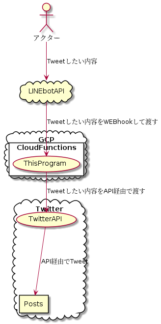

# TweetThroughLINE

## 概要

作成した公式LINEに投稿したテキストをそのままTwitterのアカウントでTweetするLINEbot

## 構成

## 環境構築

### PlantUMLの導入

 * 事前に `code` コマンドを実行できるようにしてから下記を実行する。(`code`の導入はvscodeのコマンドパレットで`shell`と打つと出る。)
 * `code --install-extension jebbs.plantuml`
 
### PlantUMLのDocker上で実行

 * `docker run -d -p 8080:8080 plantuml/plantuml-server:jetty`
